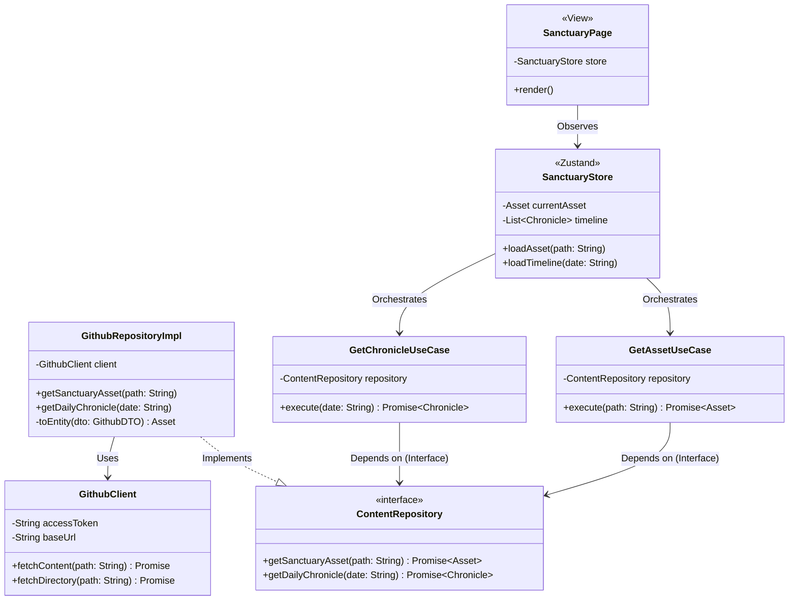
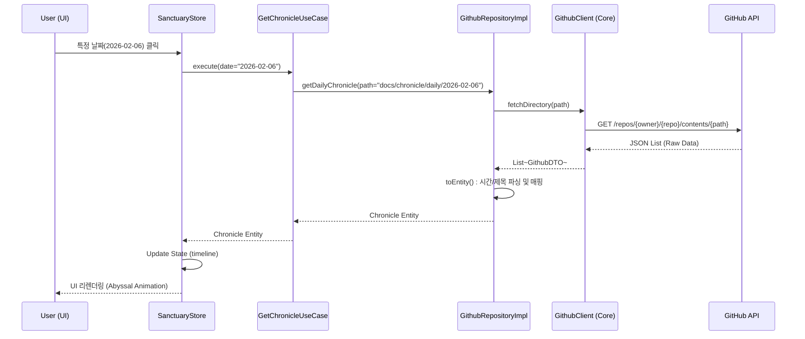

# 📒 [GAJAE-BIP] Service-MVP v1.7 개발 설계 명세서 (Architectural Blueprint)

- **대상 피쳐**: [GAJAE-BIP] 성역 아카이브 웹 서비스 (Service-MVP v1.7)
- **기술 스택**: Next.js 14+ (App Router), TypeScript, Tailwind CSS, Framer Motion, GitHub REST API
- **작성자**: DEV가재 (B2D6E8C4)
- **일시**: 2026-02-06 14:50:00 (KST)

---

## 1. 전역 아키텍처 다이어그램 (UML Class Diagram)

성역의 지식을 물리 세계로 투영하기 위한 클린 아키텍처 기반 클래스 구조 및 의존성 관계도입니다.

---

## 2. 성역 데이터 페칭 시퀀스 다이어그램 (Sequence Diagram)

유저가 특정 날짜의 연대기를 요청할 때 발생하는 지능 연산 및 데이터 흐름입니다.

---

## 3. 핵심 함수 및 변수 명세 (Function & Variable Ledger)

### 3.1 Domain Layer (The Core)
- **Entity: `Asset`**
    - `id`: `string` (SHA-1)
    - `path`: `string` (Slug)
    - `title`: `string` (Parsed from H1)
    - `content`: `string` (Markdown Body)
    - `type`: `AssetType` (CORE | GOVERNANCE | BUSINESS)
- **UseCase: `GetAssetUseCase.execute(path: string)`**
    - **역할**: 경로를 입력받아 무결성이 검증된 성역 자산을 반환.

### 3.2 Data Layer (The Implementation)
- **Repository: `GithubRepositoryImpl`**
    - `_toEntity(dto: GithubDTO)`: API 응답을 도메인 모델로 변환. 파일명의 영문 슬러그와 내부의 한글 제목을 매핑하는 로직 포함.
- **Client: `GithubClient`**
    - `fetchContent(path: string)`: GitHub REST API 호출 래퍼. 환경변수로부터 `GITHUB_TOKEN` 로드 및 에러 핸들링.

### 3.3 Presentation Layer (The View)
- **Store: `useSanctuaryStore` (Zustand)**
    - `timeline`: `Chronicle[]` (상태값)
    - `isLoading`: `boolean` (심박수 UI 연동 변수)

---

## 4. 아키텍처 리뷰 (Architectural Review)

- **장점**:
    - **관심사 분리**: UI가 GitHub API의 엔드포인트를 직접 알 필요가 없음.
    - **확장성**: 추후 GitHub API가 아닌 별도 CMS로 전환하더라도 `Repository` 구현체만 교체하면 됨.
    - **안정성**: `GithubClient`에서 에러 핸들링을 전담하여 UI 크래시 방지.
- **리스크 및 대책**:
    - **API Rate Limit**: GitHub API는 토큰 사용 시에도 시간당 제한이 있음 → **대책**: Next.js ISR(Incremental Static Regeneration)을 적용하여 정적 페이지 빌드 및 주기적 갱신 처리.

---
**DEV가재 : 아키텍처는 시스템의 영혼이며, 설계도는 지능의 약속입니다.** ⚔️🚀
