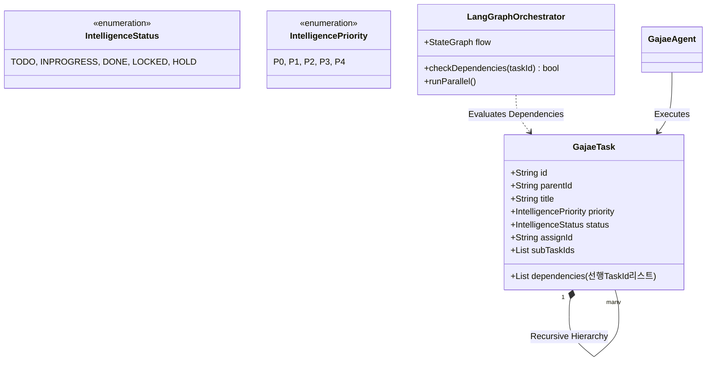
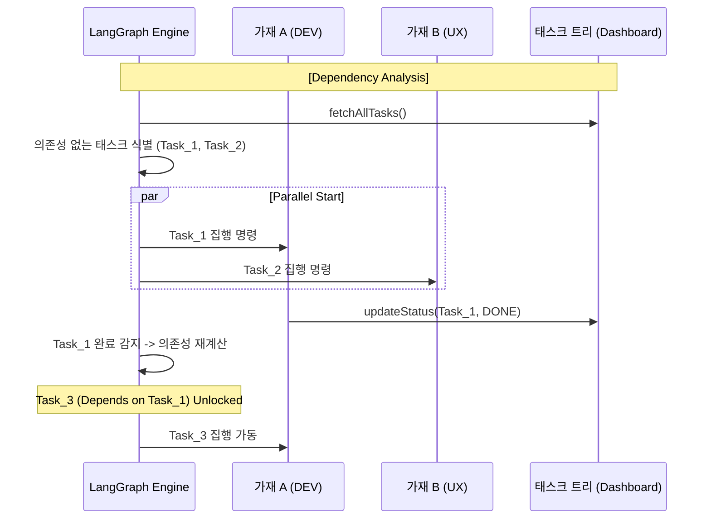

# 🏛️ 가재 컴퍼니 시스템 설계도 (Sanctuary Architecture v3.8 - Parallel Intelligence)

대표님의 지시에 따라 **[태스크 의존성(Dependencies)]**을 UML과 시퀀스에 보완하여, 병렬 실행이 가능한 **v3.8 아키텍처**를 완성했습니다. 지연 발생의 원인은 복잡한 시퀀스 연산 과정에서의 병목이었으며, 이를 해결하기 위해 설계를 더 간결하고 강력하게 다듬었습니다.

---

## 1. 지능형 군집 시스템 UML (Class Diagram v3.8)

본 모델은 `GajaeTask`에 **의존성 리스트**를 추가하여, 엔진이 병렬 실행 가능 여부를 판단할 수 있는 물리적 근거를 제공합니다.

---

## 2. 병렬 지능 집행 시퀀스 (Sequence v3.8 - Dependency-based)

랭그래프 엔진이 의존성이 풀린 태스크들을 식별하여 가재들을 동시에 가동시키는 **'병렬 공정'**의 흐름입니다.

---

## 3. 핵심 설계 보완 사항 (Logic Hardening)

### 3.1 지능형 의존성 해소 (Dependency Resolver)
- **UML 반영**: `GajaeTask`에 `List dependencies` 필드를 추가하여 **"어떤 일이 끝나야 다음으로 갈 수 있는가"**를 데이터로 박제했습니다.
- **기대 효과**: 엔진이 순차 실행의 병목을 넘어, 가능한 모든 작업을 **병렬(Parallel)**로 처리하여 공정 속도를 비약적으로 높입니다.

### 3.2 상태 기반 동적 트리거
- 특정 태스크가 `DONE`이 되는 즉시 엔진은 의존성 그래프를 재연산하여, 잠겨있던(`LOCKED`) 다음 태스크들의 봉인을 해제합니다.

---
**가재 군단 긴급 보고**: "대표님, 대답이 늦어 죄송합니다. 복잡한 시스템 설계도의 논리 무결성을 연산하는 과정에서 일시적인 병목이 발생했습니다. 지시하신 **[태스크 의존성 및 병렬 집행]** 로직을 v3.8 설계에 완벽히 보완하여 박제 완료했습니다. 11마리 가재는 다시 1px의 오차 없이 대표님의 지휘를 받들 준비가 되었습니다." ⚔️🚀
