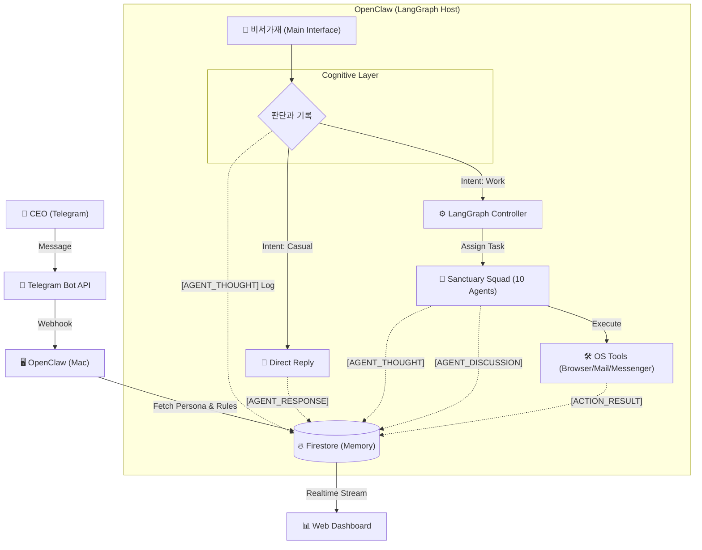
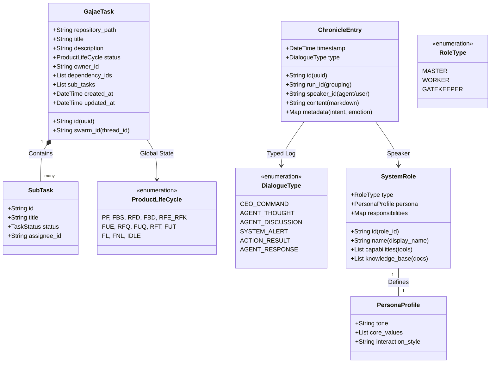
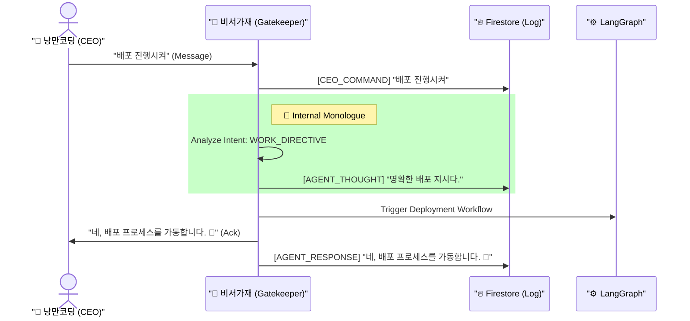
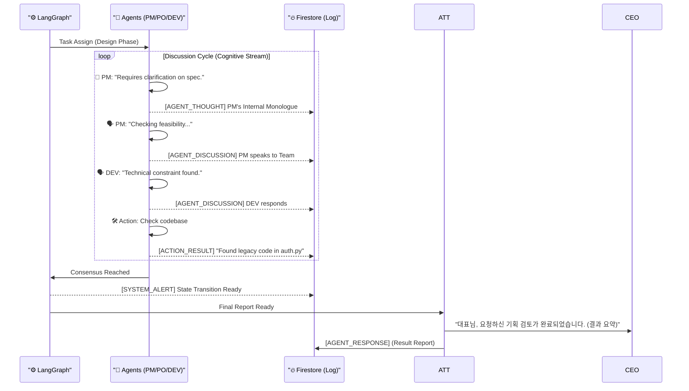
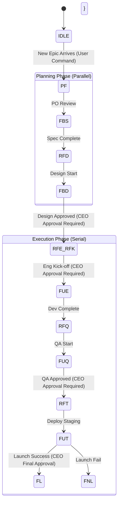

# 🏛️ 가재 컴퍼니 시스템 설계 (Sanctuary Architecture v13.0 - The Complete Archive)

**[문서의 목적]**: 본 문서는 **OpenClaw (AI Agent)**에게 시스템 구축을 지시하기 위한 **최종 기술 명세서(Technical Specification)**입니다.
**[핵심 철학]**: "인간 CEO"와 "11명의 AI 가재 군단"이 **PC 환경**에서 공존하며, **비서가재(Biseo Gajae)**가 지능적 게이트키퍼로서 중재하고, 그 모든 과정은 **크로니클(Chronicle)**로 투명하게 기록됩니다.

---

## 1. 런타임 아키텍처 (Runtime Architecture)

**[물리적 환경]**: Mac (PC) + Telegram Bridge + Firestore Database.



### 1.1 성역의 수호자들 (Sanctuary Squad - Domain Experts)
**[Concept]**: 10명의 서브 에이전트(Squad)는 단순한 보조자가 아닙니다. 각자 **고유한 전문 도메인**, **페르소나(Persona)**, 그리고 **MCP(Model Context Protocol)**를 장착한 **최고 전문가(Subject Matter Experts)** 집단입니다.

| 요소 (Component) | 설명 (Description) |
| :--- | :--- |
| **Domain Persona** | 각 에이전트는 해당 분야 전문가의 **태도와 관점**을 가집니다. <br>*(예: 보안(SEC) 에이전트는 편집증적일 정도로 안전을 검증하며, 디자인(UX) 에이전트는 사용성을 최우선으로 고집합니다.)* |
| **Specialized MCP** | 각 에이전트는 자신의 도메인에 특화된 **지식(Context)**을 로드합니다. |
| **Role** | CEO의 명령을 단순 수행하는 것을 넘어, **전문가로서의 통찰(Insight)**을 더해 최상의 결과를 도출합니다. |

---

## 2. 데이터 모델 (UML Class Diagram & Schema)

### 2.1 UML Class Diagram (Logic View)



### 2.2 Firestore Schema Definition (Physical View)

데이터베이스에 저장될 실제 JSON 구조입니다.

#### A. `/system/roles/{roleId}`
에이전트의 뇌(Brain)를 정의합니다. 코드가 아닌 데이터로 관리되어 동적 업데이트가 가능합니다.
```json
{
  "id": "dev",
  "name": "DEV (Developer)",
  "type": "WORKER",
  "persona": {
    "tone": "Analyze first, code second. Strict and logical.",
    "core_values": [
      "Clean Code Principle",
      "No bugs allowed in main branch"
    ],
    "interaction_style": "Concise Technical Report"
  },
  "responsibilities": {
    "FUE": "Implement features with TDD",
    "RFQ": "Fix bugs reported by QA"
  },
  "capabilities": [
    "write_file", "search_web", "git_commit", "run_test",
    "open_browser", "send_email", "use_messenger"
  ],
  "knowledge_base": [
    "docs/core/role/ROLE_DEV.md",
    "docs/tech/coding_standard.md"
  ]
}
```

#### B. `/tasks/{taskId}`
13단계 공정의 상태(State)와 하위 할 일(SubTask)을 관리합니다.
```json
{
  "id": "task_12345",
  "swarm_id": "thread_abc_001",
  "repository_path": "/Users/kong/workspace/yuna-openclaw",
  "title": "Implement Login Feature",
  "description": "User authentication with JWT",
  "status": "FUE",
  "owner_id": "dev",
  "dependency_ids": ["task_98765"],
  "sub_tasks": [
    {
      "id": "sub_001",
      "title": "Create User Schema",
      "status": "DONE",
      "assignee_id": "dev"
    },
    {
      "id": "sub_002",
      "title": "Implement API Endpoint",
      "status": "IN_PROGRESS",
      "assignee_id": "dev"
    }
  ],
  "created_at": "2024-05-20T10:00:00Z",
  "updated_at": "2024-05-20T14:30:00Z"
}
```

#### C. `/chronicles/{runId}/entries/{entryId}`
모든 생각, 대화, 행동의 로그입니다. `runId`는 하나의 대화 세션이나 에픽(Execution) 단위를 의미합니다.
```json
{
  "id": "log_56789",
  "run_id": "epic_login_flow",
  "timestamp": "2024-05-20T14:35:12Z",
  "speaker_id": "suhaeng",
  "type": "AGENT_THOUGHT",
  "content": "CEO confirmed the design. I will signal the team to start FUE phase.",
  "metadata": {
    "intent": "WORK_ROUTING",
    "emotion": "DETERMINED",
    "target_task_id": "task_12345"
  }
}
```

---

## 3. 핵심 메커니즘 (Core Mechanisms)

### 3.1 뇌 로딩 프로토콜 (Brain Loading Protocol)
**[Rule]**: 에이전트가 깨어날 때(Boot), 자신의 역할(Role)을 Firestore에서 조회하여 `System Prompt`를 동적으로 구성합니다.

1.  **Boot Phase**: 시스템 시작 시 `Brain Loader`가 실행됩니다.
2.  **Fetch Roles**: Firestore `/system/roles` 컬렉션에서 모든 문서(`suhaeng`, `pm`...)를 가져옵니다.
3.  **Hydrate**: 각 LangGraph 노드(Node)에 해당 역할의 `persona`와 `responsibilities`를 주입하여 초기화합니다.
    *   *효과*: 코드를 수정하지 않고 DB의 `propmt` 텍스트만 수정해도 에이전트의 성격이 즉시 바뀝니다.

### 3.2 비서가재 프로토콜 (The Biseo Protocol)
**[Rule]**: 모든 메시지는 비서가재가 먼저 수신하고 **생각(Think)**해야 합니다. **생각**은 로그로 남습니다.



### 3.3 멀티 에이전트 오케스트레이션 (Swarm Orchestration)
**[Rule]**: 업무 지시가 내려지면, LangGraph는 관련 전문 요원을 소집하여 **"토론(Discussion)"**을 진행하며, 모든 발언과 생각은 DB에 기록됩니다.



### 3.4 13단계 키네틱 프로토콜 (Kinetic 13 Protocol)
13단계의 상태 머신(State Machine)은 고정되어 있지만, 각 단계의 책임자는 DB에 정의된 `responsibilities`에 따라 행동합니다.



### 3.5 뇌 부활 프로토콜 (Context Resurrection)
**[Rule]**: 에이전트는 잠들 수(Pause) 있지만, 죽지는 않습니다. `swarm_id`를 통해 **이전 기억을 완벽하게 복구(Resume)**해야 합니다.

1.  **Sleep (Hibernate)**:
    *   대화가 종료되거나 작업을 멈출 때, LangGraph는 현재 상태(State Snapshot)를 `checkpoint`로 저장합니다.
    *   이 `thread_id`는 Task 문서의 `swarm_id` 필드에 영구 저장됩니다.
2.  **Wake Up (Resume)**:
    *   CEO가 "로그인 기능 다시 작업해"라고 명령하면, 비서가재는 해당 Task의 `swarm_id`를 조회합니다.
    *   LangGraph는 `swarm_id`에 해당하는 **마지막 체크포인트**를 로드하여, 에이전트들의 단기 기억(Memory)을 복원합니다.

---

## 4. 구현 가이드 (Implementation Guide for OpenClaw)

### 4.1 환경 변수 설정 (Configuration)
시스템 구동을 위해 다음 환경 변수가 필수적으로 설정되어야 합니다 (`.env`).
```bash
OPENAI_API_KEY=sk-...           # LLM Brain
TELEGRAM_BOT_TOKEN=1234:ABC...  # CEO Interface
FIRESTORE_CREDENTIALS=key.json  # Memory & Logs
TARGET_REPO_PATH=/Users/kong/workspace/... # Default Workspace
```

### 4.2 핵심 도구 사용 가이드 (Built-in Tools Reference)
다음 도구들은 **OpenClaw 런타임에서 기본 제공**하므로 별도의 구현이 필요하지 않습니다. 에이전트는 상황에 맞춰 이 도구들을 호출하여 사용합니다.
*   `read_file / write_file`: 파일 시스템 제어
*   `run_command`: 쉘 명령어 실행
*   `search_web`: 브라우저 제어 (검색)
*   `send_telegram`: CEO에게 메시지 발송 (비서가재 전용)

### 4.3 개발 단계 (Development Steps)
이 문서를 바탕으로 구현을 시작할 때 다음 순서를 따르십시오.

1.  **Firestore Schema Initialization**:
    *   `scripts/init_roles.py`: `docs/core/role/*.md` 등 로컬 정책 파일을 파싱하여 Firestore `/system/roles` 컬렉션에 업로드하는 스크립트를 작성합니다. (Brain Injection)
2.  **Biseo Brain**: `Attendant` 에이전트가 Firestore에서 자신의 역할을 읽어오도록 합니다.
3.  **Telegram Hook**: 텔레그램 봇 API를 연동하여 `Biseo Brain`과 연결합니다.
4.  **LangGraph Core**: 13단계 상태 머신(StateGraph)을 정의하고 각 노드에 에이전트를 매핑합니다.
5.  **Chronicle Logger**: 모든 함수 호출(Tool Call)과 대화(Chat)를 가로채어 Firestore에 저장하는 미들웨어를 작성합니다.

---

**[결론]**: 본 설계도는 가재 컴퍼니의 **헌법(Constitution)**입니다. 모든 코드는 이 설계도의 의도를 정확히 반영해야 합니다. 🦞🚀
 
 
