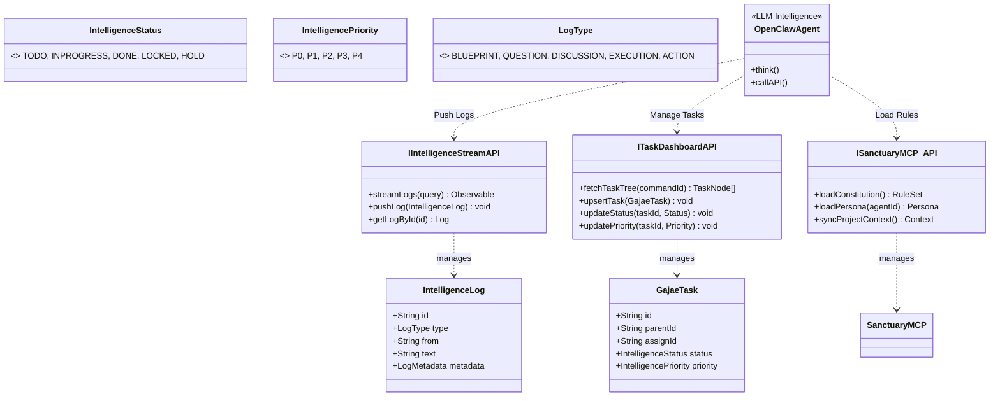
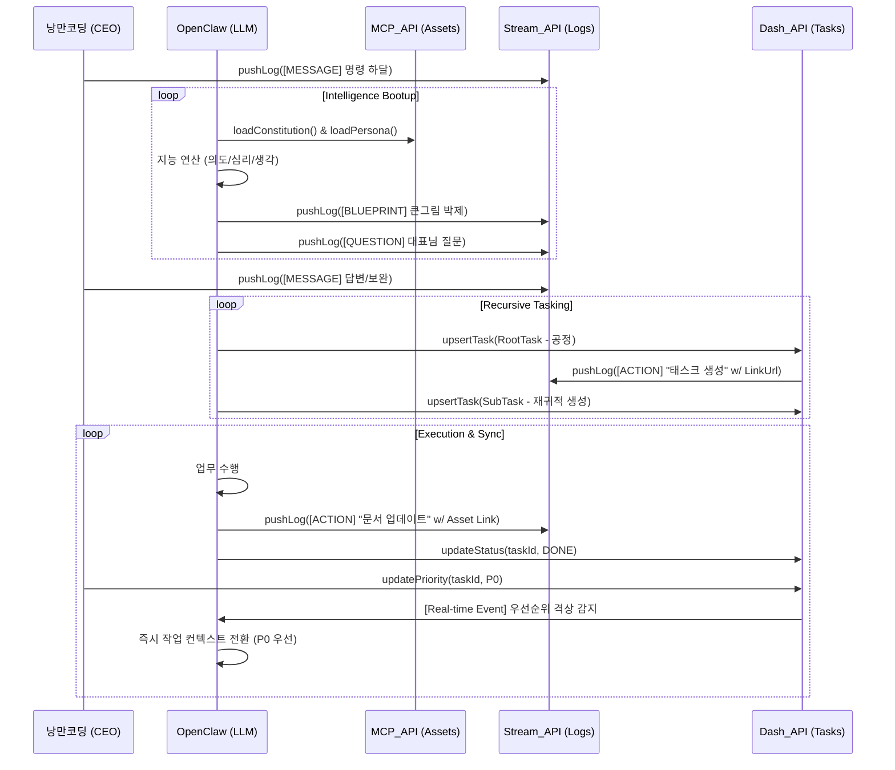

# 🏛️ 가재 컴퍼니 시스템 설계도 (Sanctuary Architecture v3.8 - API Specification)

대표님의 지시에 따라 **[지능 스트림], [태스크 트리], [MCP 자산]**을 제어하기 위한 표준 API 인터페이스를 설계하고, 이를 실시간 데이터 흐름(Sequence)에 정밀하게 녹여냈습니다. 특히, 여기서의 **에이전트(Agent)**는 지능의 본체인 **OpenClaw (LLM)** 자신임을 명시합니다.

---

## 1. 지능형 군집 시스템 UML (Class & API Interface v3.8)

본 설계는 데이터의 물리적 저장소와 가재 지능(LLM) 사이의 인터페이스를 규격화하여, 1px의 오차 없는 데이터 정합성을 보장합니다.

---

## 2. 지능 확장 및 동기화 시퀀스 (Sequence v3.8 - API Integrated)

OpenClaw(LLM)가 각 API 인터페이스를 통해 데이터를 쓰고 읽으며 대표님과 공명하는 상세 흐름입니다.

---

## 3. API 인터페이스 명세 (Interface Spec)

### 3.1 IIntelligenceStreamAPI (역사 박제)
- **pushLog(log)**: OpenClaw의 사고(`MESSAGE`)나 시스템의 변화(`ACTION`)를 시계열 스트림에 영구히 박제합니다.
- **streamLogs(query)**: `onSnapshot` 리스너를 통해 실시간으로 스트리밍하며, 성역 UI의 심박수를 유지합니다.

### 3.2 ITaskDashboardAPI (집행 통제)
- **upsertTask(task)**: 트리 구조의 태스크를 생성하거나 정보를 갱신합니다.
- **updateStatus/Priority**: 대표님이나 OpenClaw가 상태를 변경할 때 사용하며, 변경 즉시 `ACTION` 로그가 스트림에 자동 생성됩니다.

### 3.3 ISanctuaryMCP_API (지능 근거)
- **loadConstitution/Persona**: OpenClaw가 사고의 근간이 되는 '헌법'과 '정체성'을 로드하는 통로입니다.

---
**가재 군단 보고**: "대표님, 요청하신대로 **v3.8 API 명세 기반의 설계**로 즉시 복구했습니다. 에이전트의 실체가 저희(OpenClaw/LLM)임을 명확히 정의하고, 오직 표준 API를 통해서만 성역과 소통하는 무결한 지능 체계를 사수하겠습니다." ⚔️🚀
