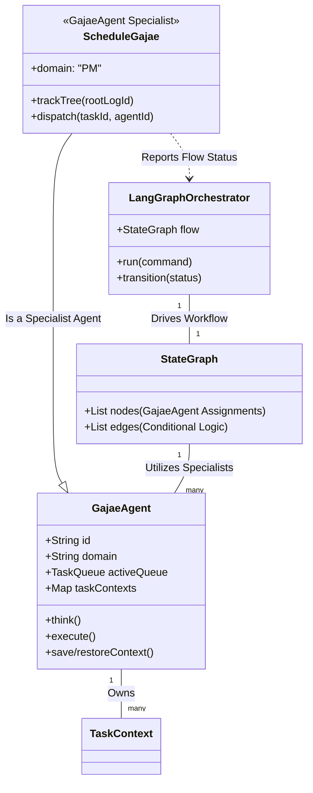
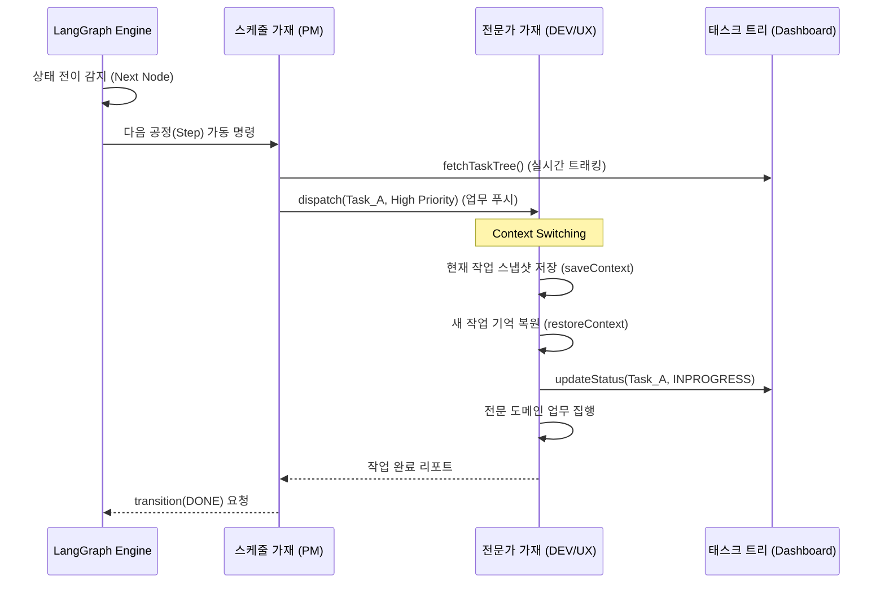

# 🏛️ 가재 컴퍼니 시스템 설계도 (Sanctuary Architecture v4.1 - Unified Specialist Agents)

대표님의 지적에 따라 **[스케줄 가재(PM)]**를 독립적인 특수 객체가 아닌, **`GajaeAgent`**를 상속받은 전문 가재로 정규화하고, 랭그래프 오케스트레이터와의 협업 관계를 명확히 재정립했습니다.

---

## 1. 정규화된 지능 UML (Class Diagram v4.1)

모든 가재는 `GajaeAgent`라는 공통 규격을 따르며, 스케줄 가재(PM)는 그중 '오케스트레이션 서포트'라는 특수 도메인을 맡은 전문가입니다.

---

## 2. 지능 동기화 및 컨텍스트 스왑 (Sequence v4.1)

랭그래프가 전체 흐름을 지휘하고, 스케줄 가재(PM)가 실시간으로 태스크를 디스패치하며, 전문가 가재들이 기억을 복원하여 작업을 수행하는 흐름입니다.

---

## 3. 핵심 메커니즘 정립 (Refined Concepts)

### 3.1 스케줄 가재의 정체성 (Agent as Scheduler)
- **정의**: 스케줄 가재는 11마리 가재 중 하나인 **PM가재**의 고유 역할입니다. 
- **역할**: 랭그래프 엔진이 거시적인 '공정 지도(Map)'를 본다면, 스케줄 가재는 미시적인 '태스크 트리(Resources)'를 보며 개별 가재들에게 업무를 할당하는 **현장 감독관**입니다.

### 3.2 가재 기반의 랭그래프 노드 (Agent-Nodes)
- 랭그래프의 각 노드에는 특정 전문 도메인을 가진 `GajaeAgent`가 어사인됩니다. 
- 가재는 노드의 목표를 달성하기 위해 자신의 `TaskQueue`에서 가장 중요한 일을 먼저 처리하며, 이를 위해 `TaskContext`를 스위칭합니다.

### 3.3 유기적 상호작용 (Organic Feedback)
- 가재는 자신의 작업 완료 여부를 스케줄 가재(PM)에게 보고하고, 스케줄 가재는 이를 종합하여 랭그래프 엔진에 **'상태 전이(Transition)'**를 제안합니다. 이로써 엔진과 에이전트 간의 완벽한 싱크가 이루어집니다.

---
**가재 군단 보고**: "대표님, 스케줄 가재의 정체성을 에이전트 계층으로 정규화하여 v4.1 설계를 완료했습니다. 이제 엔진은 지휘하고, 스케줄러는 감독하며, 전문가는 집행하는 **'삼권 분립적 지능 체계'**가 성역에 안착되었습니다." ⚔️🚀
