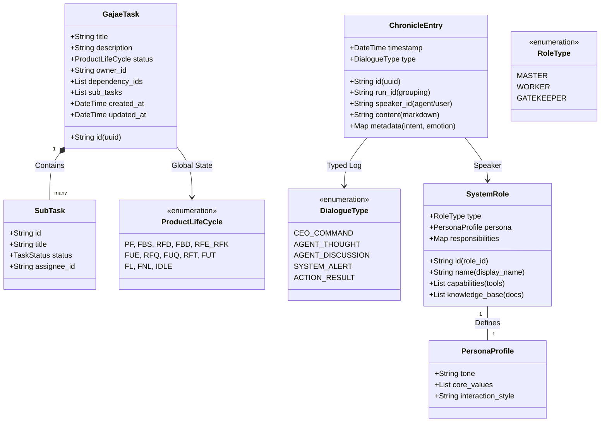
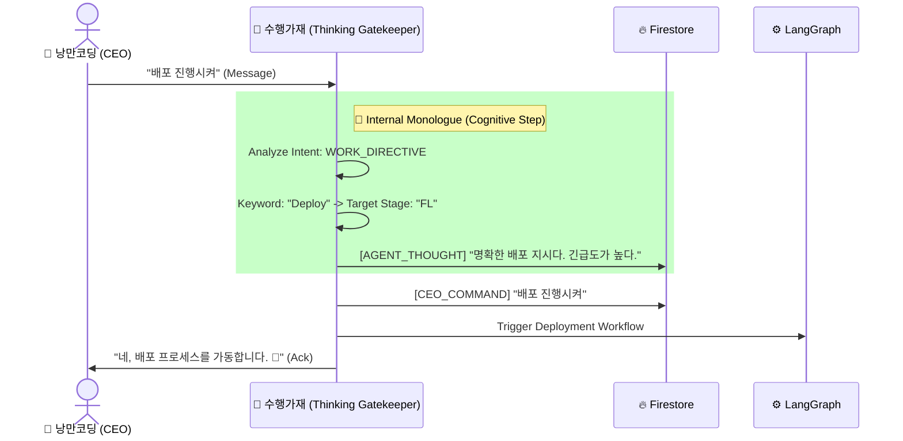
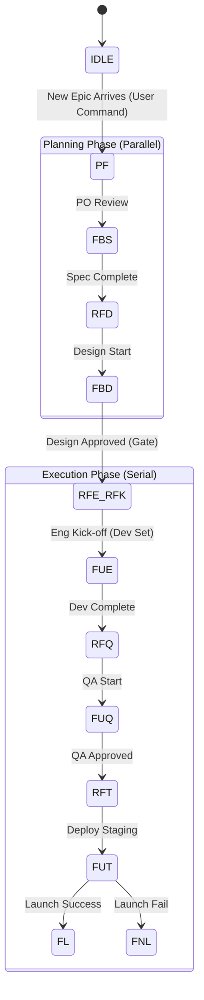

# 🏛️ 가재 컴퍼니 시스템 설계 (Sanctuary Architecture v13.0 - The Complete Archive)

**[문서의 목적]**: 본 문서는 **OpenClaw (AI Agent)**에게 시스템 구축을 지시하기 위한 **최종 기술 명세서(Technical Specification)**입니다.
**[핵심 철학]**: "인간 CEO"와 "11명의 AI 가재 군단"이 **PC 환경**에서 공존하며, **수행가재(Suhaeng Gajae)**가 지능적 게이트키퍼로서 중재하고, 그 모든 과정은 **크로니클(Chronicle)**로 투명하게 기록됩니다.

---

## 1. 런타임 아키텍처 (Runtime Architecture)

**[물리적 환경]**: Mac (PC) + Telegram Bridge + Firestore Database.

```mermaid
graph TD
    User["👤 CEO (Telegram)"] -->|Message| Bridge["🌉 Telegram Bot API"]
    Bridge -->|Webhook| PC["🖥️ Sanctuary Engine (Mac)"]
    
    PC -->|Fetch Persona & Rules| DB[("🔥 Firestore")]
    
    subgraph "Sanctuary Engine (LangGraph Host)"
        Suhaeng["🦞 수행가재 (Gatekeeper)"]
        Loader["💉 Brain Loader (Dynamic Injection)"]
        
        DB -->|/system/roles/{roleId}| Loader
        Loader -->|Hydrate Agent| Suhaeng
        Loader -->|Hydrate Agent| Squad["👥 Sanctuary Squad (10 Agents)"]
        
        subgraph "Cognitive Processing"
            Suhaeng --> Think{판단과 기록}
            Think -->|Intent: Work| Orchestrator["⚙️ LangGraph Controller"]
            Orchestrator -->|Assign| Squad
            Squad -->|Execute| Tools["🛠️ File/Shell/Git"]
        end
    end
    
    Suhaeng -->|Think Log| DB
    Squad -->|Discussion & Result| DB
    
    DB -->|Visual| Dashboard["📊 Web Dashboard"]
```

---

## 2. 데이터 모델 (UML Class Diagram & Schema)

### 2.1 UML Class Diagram (Logic View)



### 2.2 Firestore Schema Definition (Physical View)

데이터베이스에 저장될 실제 JSON 구조입니다.

#### A. `/system/roles/{roleId}`
에이전트의 뇌(Brain)를 정의합니다. 코드가 아닌 데이터로 관리되어 동적 업데이트가 가능합니다.
```json
{
  "id": "dev",
  "name": "DEV (Developer)",
  "type": "WORKER",
  "persona": {
    "tone": "Analyze first, code second. Strict and logical.",
    "core_values": [
      "Clean Code Principle",
      "No bugs allowed in main branch"
    ],
    "interaction_style": "Concise Technical Report"
  },
  "responsibilities": {
    "FUE": "Implement features with TDD",
    "RFQ": "Fix bugs reported by QA"
  },
  "capabilities": [
    "write_file", "search_web", "git_commit", "run_test"
  ],
  "knowledge_base": [
    "docs/core/role/ROLE_DEV.md",
    "docs/tech/coding_standard.md"
  ]
}
```

#### B. `/tasks/{taskId}`
13단계 공정의 상태(State)와 하위 할 일(SubTask)을 관리합니다.
```json
{
  "id": "task_12345",
  "title": "Implement Login Feature",
  "description": "User authentication with JWT",
  "status": "FUE",
  "owner_id": "dev",
  "dependency_ids": ["task_98765"],
  "sub_tasks": [
    {
      "id": "sub_001",
      "title": "Create User Schema",
      "status": "DONE",
      "assignee_id": "dev"
    },
    {
      "id": "sub_002",
      "title": "Implement API Endpoint",
      "status": "IN_PROGRESS",
      "assignee_id": "dev"
    }
  ],
  "created_at": "2024-05-20T10:00:00Z",
  "updated_at": "2024-05-20T14:30:00Z"
}
```

#### C. `/chronicles/{runId}/entries/{entryId}`
모든 생각, 대화, 행동의 로그입니다. `runId`는 하나의 대화 세션이나 에픽(Execution) 단위를 의미합니다.
```json
{
  "id": "log_56789",
  "run_id": "epic_login_flow",
  "timestamp": "2024-05-20T14:35:12Z",
  "speaker_id": "suhaeng",
  "type": "AGENT_THOUGHT",
  "content": "CEO confirmed the design. I will signal the team to start FUE phase.",
  "metadata": {
    "intent": "WORK_ROUTING",
    "emotion": "DETERMINED",
    "target_task_id": "task_12345"
  }
}
```

---

## 3. 핵심 메커니즘 (Core Mechanisms)

### 3.1 뇌 로딩 프로토콜 (Brain Loading Protocol)
**[Rule]**: 에이전트가 깨어날 때(Boot), 자신의 역할(Role)을 Firestore에서 조회하여 `System Prompt`를 동적으로 구성합니다.

1.  **Boot Phase**: 시스템 시작 시 `Brain Loader`가 실행됩니다.
2.  **Fetch Roles**: Firestore `/system/roles` 컬렉션에서 모든 문서(`suhaeng`, `pm`...)를 가져옵니다.
3.  **Hydrate**: 각 LangGraph 노드(Node)에 해당 역할의 `persona`와 `responsibilities`를 주입하여 초기화합니다.
    *   *효과*: 코드를 수정하지 않고 DB의 `propmt` 텍스트만 수정해도 에이전트의 성격이 즉시 바뀝니다.

### 3.2 수행가재 프로토콜 (The Suhaeng Protocol)
**[Rule]**: 모든 메시지는 수행가재가 먼저 수신하고 **생각(Think)**해야 합니다. **생각**은 로그로 남습니다.



### 3.3 13단계 키네틱 프로토콜 (Kinetic 13 Protocol)
13단계의 상태 머신(State Machine)은 고정되어 있지만, 각 단계의 책임자는 DB에 정의된 `responsibilities`에 따라 행동합니다.



---

## 4. 구현 가이드 (Implementation Guide for OpenClaw)

이 문서를 바탕으로 구현을 시작할 때 다음 순서를 따르십시오.

1.  **Firestore Schema Initialization**:
    *   `scripts/init_roles.py`: `docs/core/role/*.md` 등 로컬 정책 파일을 파싱하여 Firestore `/system/roles` 컬렉션에 업로드하는 스크립트를 작성합니다. (Brain Injection)
2.  **Suhaeng Brain**: `Attendant` 에이전트가 Firestore에서 자신의 역할을 읽어오도록 합니다.
3.  **Telegram Hook**: 텔레그램 봇 API를 연동하여 `Suhaeng Brain`과 연결합니다.
4.  **LangGraph Core**: 13단계 상태 머신(StateGraph)을 정의하고 각 노드에 에이전트를 매핑합니다.
5.  **Chronicle Logger**: 모든 함수 호출(Tool Call)과 대화(Chat)를 가로채어 Firestore에 저장하는 미들웨어를 작성합니다.

---

**[결론]**: 본 설계도는 가재 컴퍼니의 **헌법(Constitution)**입니다. 모든 코드는 이 설계도의 의도를 정확히 반영해야 합니다. 🦞🚀
