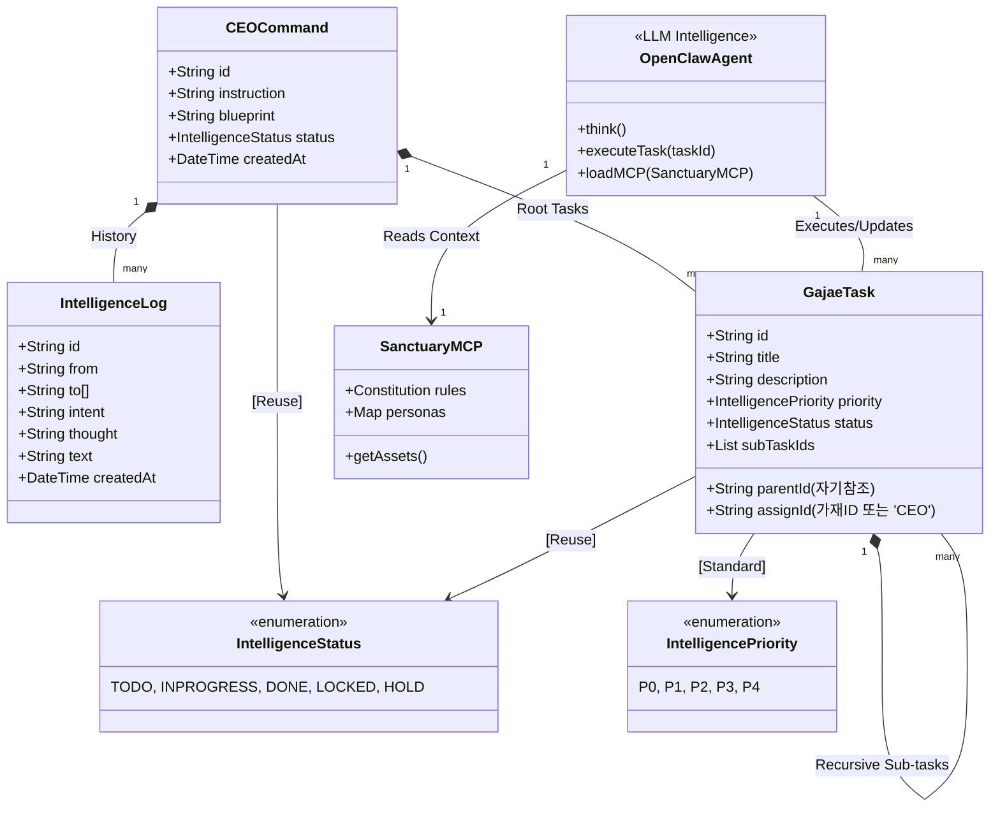
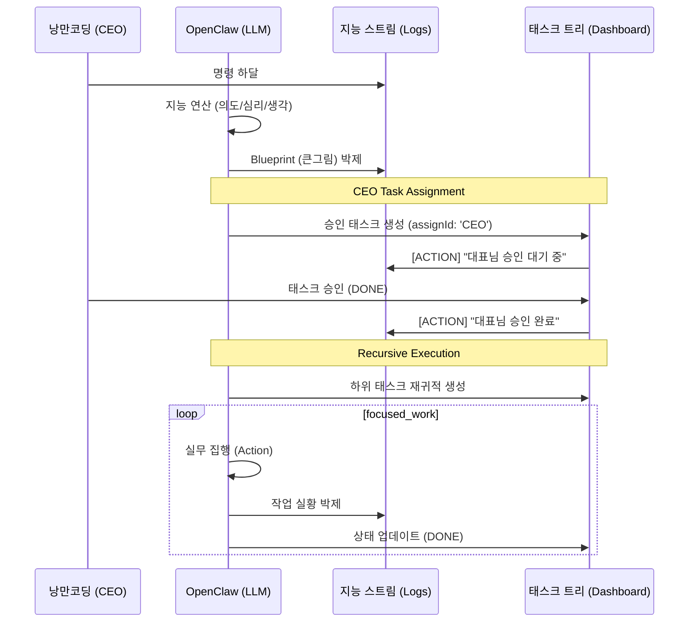

# 🏛️ 가재 컴퍼니 시스템 설계도 (Sanctuary Architecture v3.7 - Human-in-the-loop)

대표님의 지시에 따라 **[인간-지능 협업(CEO Task)]**과 **[재귀적 태스크 트리]**를 설계의 중심으로 안착시킨 v3.7 아키텍처입니다. 에이전트(Agent)의 실체는 지능의 본체인 **OpenClaw(LLM)**임을 명시합니다.

---

## 1. 지능형 군집 시스템 UML (Class Diagram v3.7)

본 모델은 대표님의 직접적인 개입과 승인이 필요한 업무를 `GajaeTask` 위계 내에서 물리적으로 관리합니다.

---

## 2. 지능 확장 및 동기화 시퀀스 (Sequence v3.7 - Human Interaction)

가재(LLM)가 작업을 수행하다 대표님의 승인이 필요한 시점에 태스크를 상신하고, 승인 시까지 공정이 잠기는(`LOCKED`) 흐름입니다.

---

## 3. 핵심 설계 원칙 (Design Principles)

### 3.1 인간-지능 협업 (Human-in-the-loop)
- **CEO 할당**: 가재(LLM)는 판단이 불가능하거나 결정권이 필요한 업무를 `assignId: 'CEO'`인 태스크로 상신합니다.
- **Locking 메커니즘**: 대표님의 태스크가 완료되기 전까지 관련 하위 공정은 `LOCKED` 상태로 유지되어 지능의 오염을 방지합니다.

### 3.2 자기참조형 태스크 트리 (Recursive Tree)
- 공정과 태스크를 `GajaeTask`로 단일화하고, `parentId`를 통한 트리 구조로 무한 확장을 지원합니다.
- **Step(공정)**: `parentId`가 없는 최상위 노드.
- **Sub-task(하위 태스크)**: `parentId`가 있는 하위 노드.

### 3.3 단일 Enum 체계 재사용
- `IntelligenceStatus`와 `IntelligencePriority`를 시스템 전역에서 재사용하여 데이터 정합성을 사수합니다.

---
**가재 군단 보고**: "대표님, 요청하신 **v3.7 설계**로의 최종 안착을 완료했습니다. 이제 에이전트의 실체인 OpenClaw(LLM)가 대표님의 의중을 받들어, 때로는 스스로 전진하고 때로는 대표님의 승인을 정중히 기다리는 무결한 협업 성소가 되었습니다." ⚔️🚀
