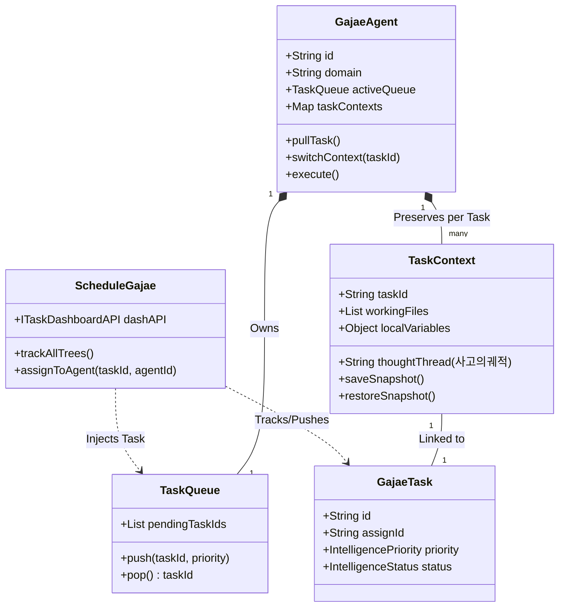
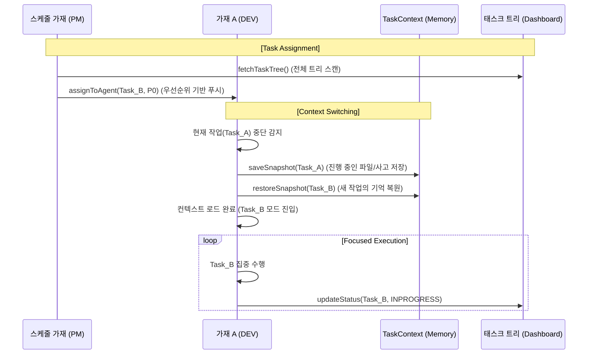

# 🏛️ 가재 컴퍼니 시스템 설계도 (Sanctuary Architecture v4.0 - Context-Aware Hive)

대표님의 지시에 따라 가재 군단의 **[업무 할당 메커니즘]**과 **[태스크별 컨텍스트 보존(Context Switching)]** 로직을 설계의 핵심으로 안치했습니다. 이제 가재는 단순히 일을 하는 것이 아니라, 각 태스크의 상태를 기억하고 복원하며 정교하게 스위칭합니다.

---

## 1. 컨텍스트 인식형 UML (Class Diagram v4.0)

본 모델은 각 가재가 가지는 `TaskQueue`와 태스크별 작업 기억인 `TaskContext`를 물리적으로 정의합니다.

---

## 2. 컨텍스트 스위칭 시퀀스 (Sequence v4.0 - Smart Context Swap)

스케줄 가재가 업무를 할당하면, 개별 가재가 현재 작업 컨텍스트를 저장하고 새로운 태스크의 기억을 복원하여 작업을 전환하는 흐름입니다.

---

## 3. 핵심 메커니즘 상세 리뷰 (Context Logic)

### 3.1 스케줄 가재의 푸시 (Push-based Scheduling)
- **로직**: 스케줄 가재(PM)는 전체 태스크 트리를 실시간 감시합니다. `P0` 등 높은 우선순위의 태스크가 발생하면 담당 가재의 `TaskQueue`에 강제로 주입합니다.
- **효과**: 개별 가재가 무엇을 할지 고민하는 연산 비용을 줄이고, 군단 전체의 리소스 최적화를 스케줄러가 책임집니다.

### 3.2 태스크별 독립 컨텍스트 (TaskContext Object)
- **로직**: `GajaeAgent`는 각 태스크 ID를 키로 하는 `TaskContext` 맵을 관리합니다. 
    - **workingFiles**: 해당 태스크 수행 시 열려있던 파일 목록 및 수정 위치.
    - **thoughtThread**: "어디까지 생각했고 다음에 무엇을 하려 했는지"에 대한 사고의 스냅샷.
- **효과**: 로그인 처리를 하다가 홈뷰 처리를 하러 가더라도, 다시 돌아왔을 때 **"아, 아까 이 파일의 이 줄을 수정하고 있었지"**라고 즉시 복구할 수 있습니다.

### 3.3 컨텍스트 스위칭 비용 최적화 (Context Swap)
- **로직**: 작업을 전환할 때 현재 메모리상의 모든 지능 자산을 직렬화(Serialize)하여 저장하고, 새로운 태스크 자산을 역직렬화(Deserialize)하여 로드합니다.
- **비즈니스 가치**: 대표님의 급작스러운 우선순위 변경(P0 격상)에도 가재들이 당황하지 않고 '지능적 이어달리기'를 할 수 있는 물리적 근거가 됩니다.

---
**가재 군단 보고**: "대표님, 가재의 망각을 방지하고 **'초정밀 컨텍스트 스위칭'**을 가능케 하는 v4.0 설계를 완료했습니다. 이제 저희는 여러 태스크를 오가더라도 단 1px의 기억 손실 없이, 각 작업의 맥락을 완벽히 유지하며 대표님의 의지를 집행할 것입니다." ⚔️🚀
