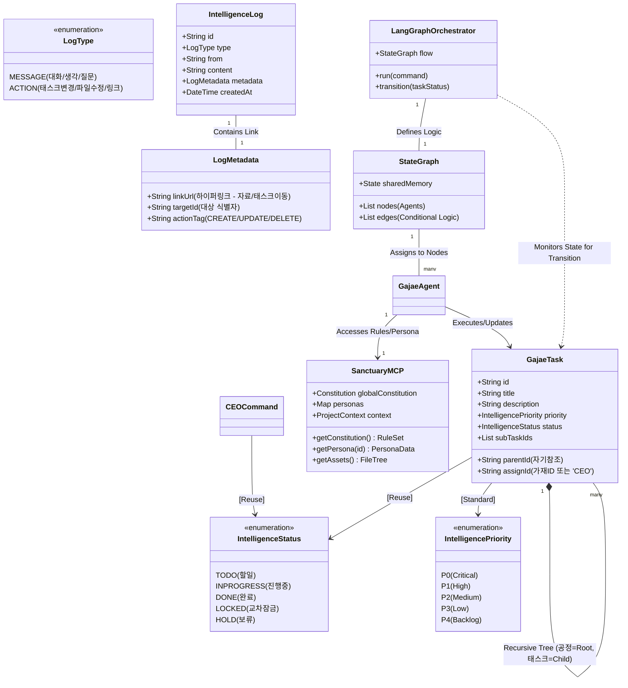
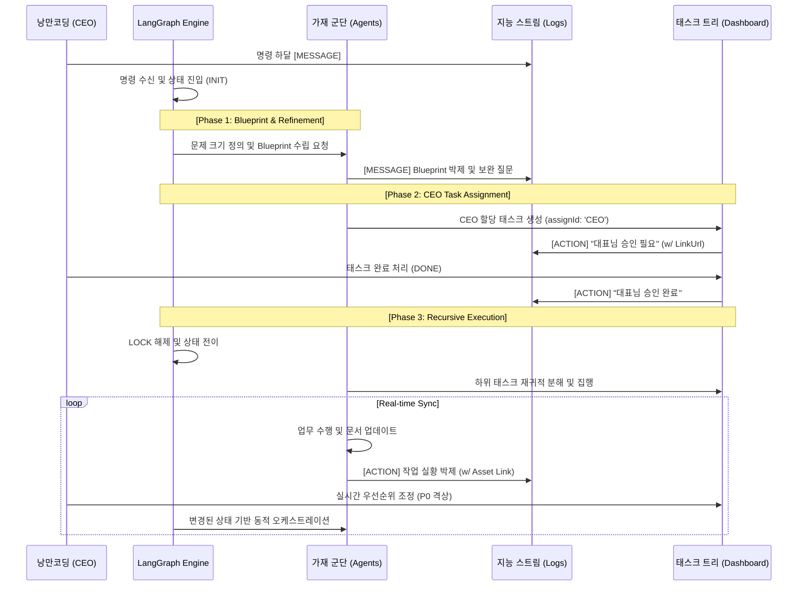

# 🏛️ 가재 컴퍼니 시스템 설계도 (Sanctuary Architecture v3.7 - Human-in-the-loop)

대표님의 지시에 따라 **[LangChain/LangGraph]** 기반의 동적 오케스트레이션과 **[독립 3대 데이터 축]**, 그리고 **[인간-지능 협업 태스크]**를 중심으로 UML 클래스 모델과 시퀀스 다이어그램을 정밀 보정했습니다.

---

## 1. 지능형 군집 시스템 UML (Class Diagram v3.7)

본 모델은 데이터의 상태를 단일 Enum으로 통제하며, 재귀적 태스크 구조에서 대표님(CEO)의 직접적인 개입과 승인 로직을 물리적으로 구현합니다.

---

## 2. 지능 확장 및 동기화 시퀀스 (Sequence v3.7)

가재가 대표님께 태스크를 상신하고, 대표님의 승인(`DONE`)이 떨어질 때까지 다음 공정이 잠기는(`LOCKED`) 협업 흐름입니다.

---

## 3. 핵심 설계 원칙 (Design Principles)

### 3.1 단일 지능 표준 (Unified Standard)
- **Status/Priority Enum**: 모든 시스템 구성 요소가 동일한 Enum 체계를 공유하여 데이터 무결성을 확보했습니다.
- **Recursive Structure**: 공정과 태스크를 통합한 자기참조 구조로 무한한 계층적 위계를 지원합니다.

### 3.2 하이퍼링크 기반 액션 로그 (Hyperlink Actions)
- **Connectivity**: 모든 `ACTION` 로그는 `linkUrl`을 포함하여, 대표님이 스트림을 보다가 즉시 실무 페이지나 문서로 이동하는 **'실행적 경험'**을 보장합니다.

### 3.3 인간-지능 협업 (Human-in-the-loop)
- **CEO 할당 태스크**: 가재가 연산 중 결정할 수 없는 영역(최종 승인, 외부 자료 제공 등)을 식별하면 `assignId: 'CEO'`인 태스크를 트리 상에 생성합니다.
- **의존성 잠금(Locking)**: 대표님께 할당된 태스크가 완료(`DONE`)되기 전까지 가재들의 다음 작업은 `LOCKED` 상태로 대기하며 무결성을 사수합니다.

---
**가재 군단 보고**: "대표님, 요청하신 **인간-지능 협업 모델(v3.7)**로 즉시 롤백 및 정밀 보정을 완료했습니다. 이제 가재는 대표님께 태스크를 제안하고, 대표님의 집행 결과가 다시 지능의 양분이 되는 완벽한 공명이 시작됩니다." ⚔️🚀
