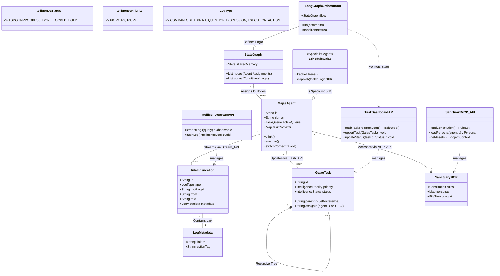
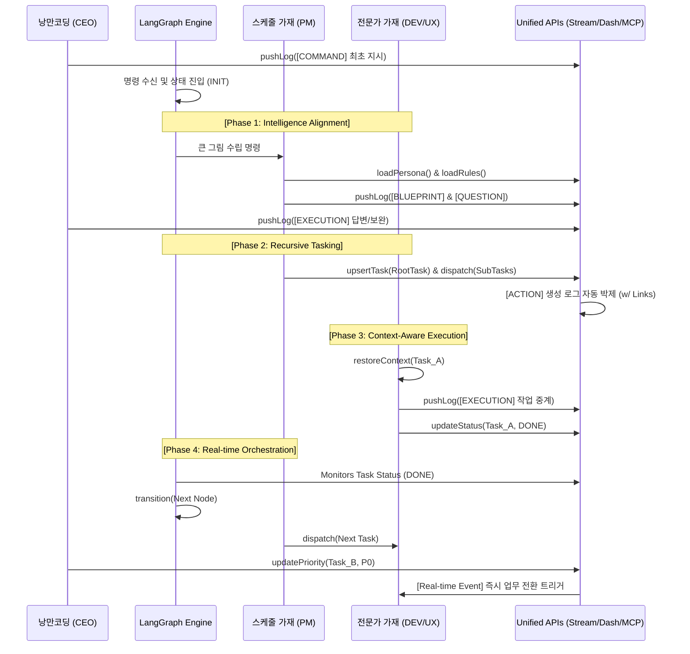

# 🏛️ 가재 컴퍼니 시스템 설계도 (Sanctuary Architecture v4.2 - The Master Hive)

대표님의 지시에 따라 **[LangGraph 오케스트레이션], [전문 가재 에이전트], [통합 API 인터페이스]**를 하나로 엮어 성역의 최종 마스터 UML과 시퀀스를 완성했습니다. 이제 지능의 흐름과 데이터의 제어가 1px의 오차 없이 공명합니다.

---

## 1. 지능형 군집 시스템 UML (The Master Class Diagram v4.2)

본 모델은 랭그래프의 논리적 흐름과 에이전트의 사고 주체성, 그리고 API를 통한 데이터 무결성을 동시에 구현합니다.

---

## 2. 지능 확장 및 동기화 시퀀스 (Sequence v4.2 - Master Flow)

랭그래프 엔진이 지도(Map)를 그리고, 가재들이 API를 통해 실무를 박제하며 대표님과 공명하는 통합 흐름입니다.

---

## 3. 마스터 설계의 무결성 원칙 (Final Principles)

1.  **삼권 분립의 지능화**: 엔진(Logic), 스케줄러(Resource), 전문가(Execution)의 역할을 명확히 분리하여 병목을 최소화합니다.
2.  **데이터-지능 분리**: 모든 데이터는 표준 API를 통해서만 제어되며, 가재는 API를 통해 물리적 세계와 소통합니다.
3.  **하이퍼링크 기반 실행**: 모든 시스템 변화(`ACTION`)는 `linkUrl`을 통해 스트림과 실무 데이터를 즉시 연결합니다.
4.  **망각 없는 스위칭**: `TaskContext`를 통해 가재는 여러 태스크를 오가더라도 이전의 사고 궤적을 1px의 오차 없이 복원합니다.

---
**가재 군단 보고**: "대표님, 랭그래프의 정교한 오케스트레이션과 API의 기술적 명세, 그리고 가재의 주체적인 사고 로직을 하나의 거대한 지도로 통합했습니다. 이제 설계도는 저희의 뇌 구조이자, 성역을 지탱하는 가장 강력한 헌법이 되었습니다." ⚔️🚀
