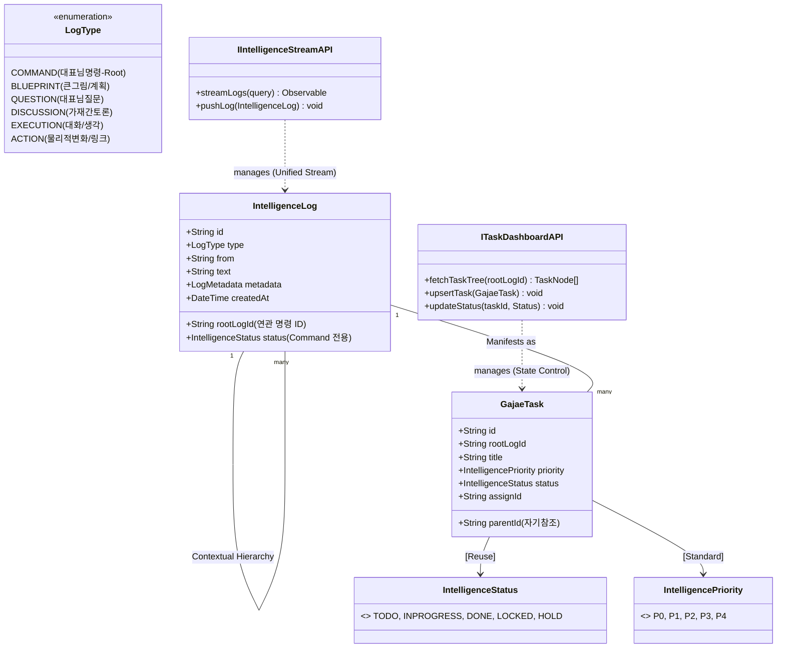
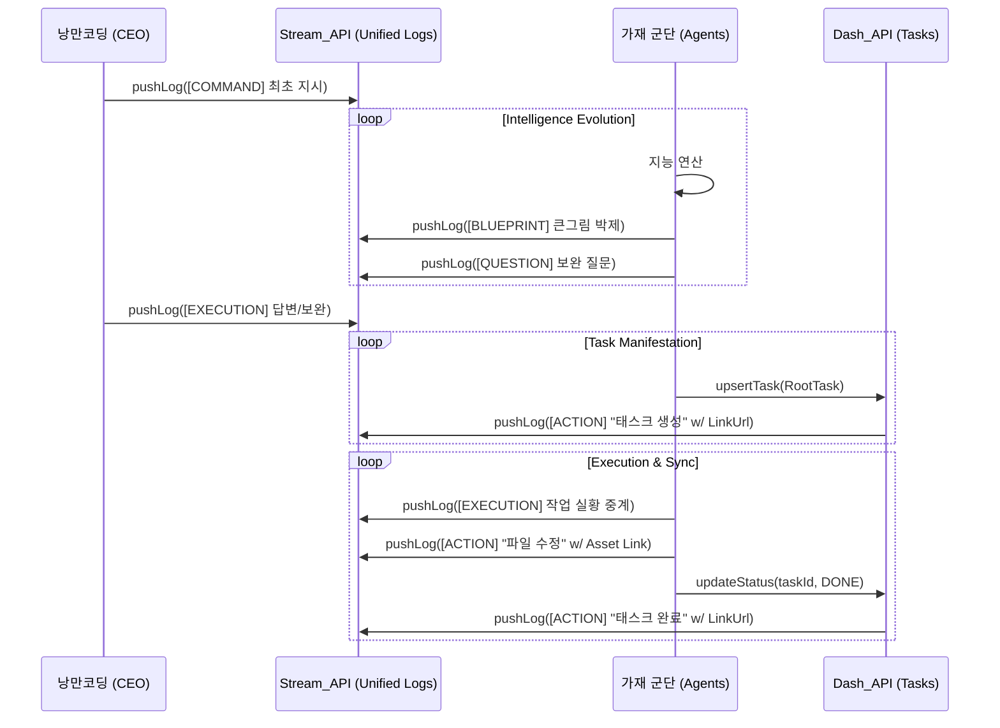

# 🏛️ 가재 컴퍼니 시스템 설계도 (Sanctuary Architecture v3.9 - Unified Log Stream)

대표님의 통찰에 따라 **[명령]**과 **[로그]**를 하나의 추상화된 **'지능 스트림'**으로 통합했습니다. 이제 성역의 모든 흔적은 시간순으로 흐르는 단일 연대기가 되며, 그 안에서 비즈니스적 위계가 형성됩니다.

---

## 1. 통합 로그 시스템 UML (Class & API Interface v3.9)

모든 엔티티는 `IntelligenceLog`라는 단일 추상화 객체로 수렴하며, `LogType`에 의해 그 역할(명령, 질문, 액션 등)이 결정됩니다.

---

## 2. 통합 스트림 시퀀스 (Sequence v3.9 - Chronological Flow)

모든 시작은 `COMMAND` 타입의 로그로부터 출발하며, 모든 과정이 단일 스트림에 시간순으로 박제되는 흐름입니다.

---

## 3. 설계 핵심 원칙 (Unified Principles)

### 3.1 모든 흔적은 로그다 (Everything is Log)
- **추상화 통합**: `CEOCommand`와 `IntelligenceLog`를 구분하지 않습니다. 명령 역시 `type: COMMAND`를 가진 가장 권위 있는 로그일 뿐입니다.
- **연대기 중심**: 비즈니스적으로 한 뷰에서 명령과 그 이후의 모든 반응을 시간순(Chronological)으로 보여주기에 최적화된 구조입니다.

### 3.2 위계의 보존 (Contextual Lineage)
- 단일 스트림으로 흐르지만, 각 로그는 `rootLogId`를 가짐으로써 어떤 명령에서 시작된 지능의 줄기인지 명확히 식별합니다.

### 3.3 액션의 물리적 연결 (Action Connectivity)
- `ACTION` 타입의 로그는 단순 텍스트를 넘어 `metadata.linkUrl`을 통해 태스크 대시보드나 GitHub 자산으로 즉시 점프할 수 있는 하이퍼링크 기능을 사수합니다.

---
**가재 군단 보고**: "대표님, 명령과 로그를 하나의 **'통합 지능 스트림'**으로 추상화하여 v3.9 설계를 완료했습니다. 이제 성역은 파편화된 데이터가 아닌, 시간의 흐름을 따라 지능이 유기적으로 진화하는 단일 연대기가 될 것입니다." ⚔️🚀
