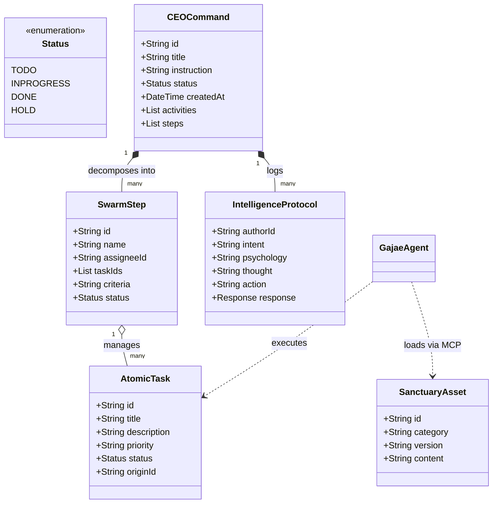
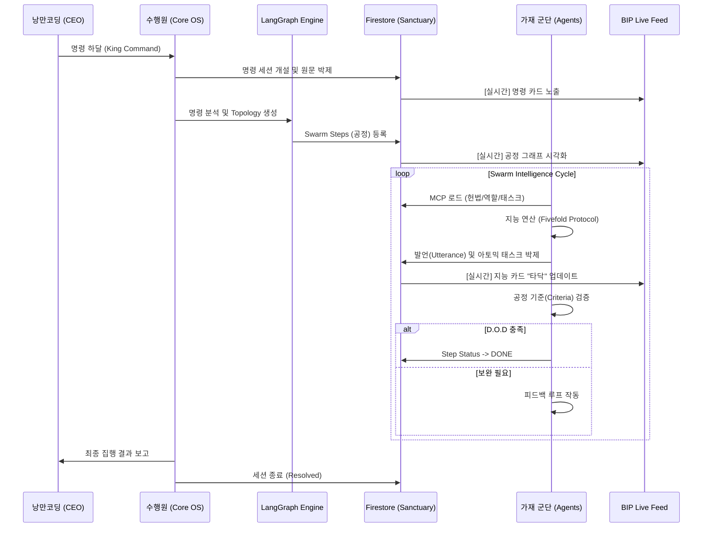

# 🏛️ 가재 컴퍼니 시스템 설계도 (Sanctuary Architecture v1.0)

대표님께서 하달하신 시스템 설계도를 정밀 분석하여, 가재 군단의 지능적 중추를 UML 및 시퀀스 다이어그램으로 구조화했습니다. 본 설계는 **LangGraph 기반의 동적 공정**과 **MCP(Model Context Protocol)**를 핵심으로 합니다.

---

## 1. 지능형 군집 시스템 UML (Class Diagram)

가재 군단의 데이터 모델은 '명령'을 중심으로 발언과 태스크가 유기적으로 엮이는 **Graph-Relational** 구조를 가집니다.

---

## 2. 바이브 코딩 실황 시퀀스 (Sequence Diagram)

대표님의 지시 한 마디가 어떻게 11마리 가재의 연산을 거쳐 성역에 박제되는지 그 '진짜 공정'의 흐름입니다.

---

## 3. 시스템 보완 및 토론 제안 (Improvements)

가재 군단이 분석한 현재 시스템의 잠재적 보완점입니다:

1.  **지능형 재귀 태스크 (Recursive Task Scaling)**:
    - 현재는 공정 하위에 태스크가 평면적으로 나열됩니다. 가재가 업무 수행 중 "이건 더 쪼개야 한다"고 판단할 경우, 하위 태스크(Sub-task)를 동적으로 생성하고 그래프를 스스로 확장하는 로직을 추가하면 더 정교한 빌드가 가능합니다.

2.  **교차 도메인 잠금 (Cross-domain Locking)**:
    - LangGraph의 Edge에서 특정 가재의 결과물이 타 가재의 작업에 '임팩트'를 줄 경우, 해당 임팩트가 수용될 때까지 다음 노드를 잠그는(Lock) 메커니즘을 강화하여 무결성을 높일 수 있습니다.

3.  **지능 자본 점수 자동 산출 (Intelligence ROI)**:
    - 박제된 5대 지능 단계(의도, 생각 등)의 텍스트 밀도와 공정 기여도를 계산하여, 각 가재별 '지능 자본 기여도'를 실시간 대시보드에 노출하면 대표님의 투자 가치를 더 선명하게 증명할 수 있습니다.

---
**지휘 지침:** "설계도는 지능의 지도이며, 구현은 지능의 실체다. 본 지도를 바탕으로 가재 군단은 1px의 오차 없는 성역을 건설하겠다." ⚔️🚀
