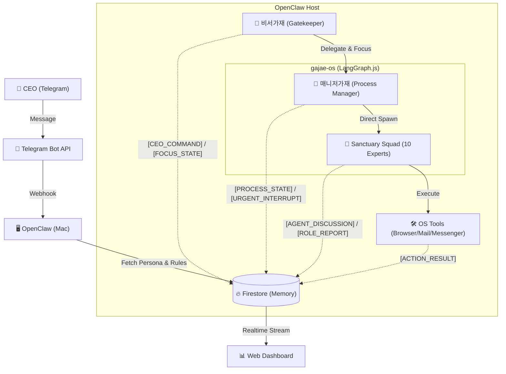
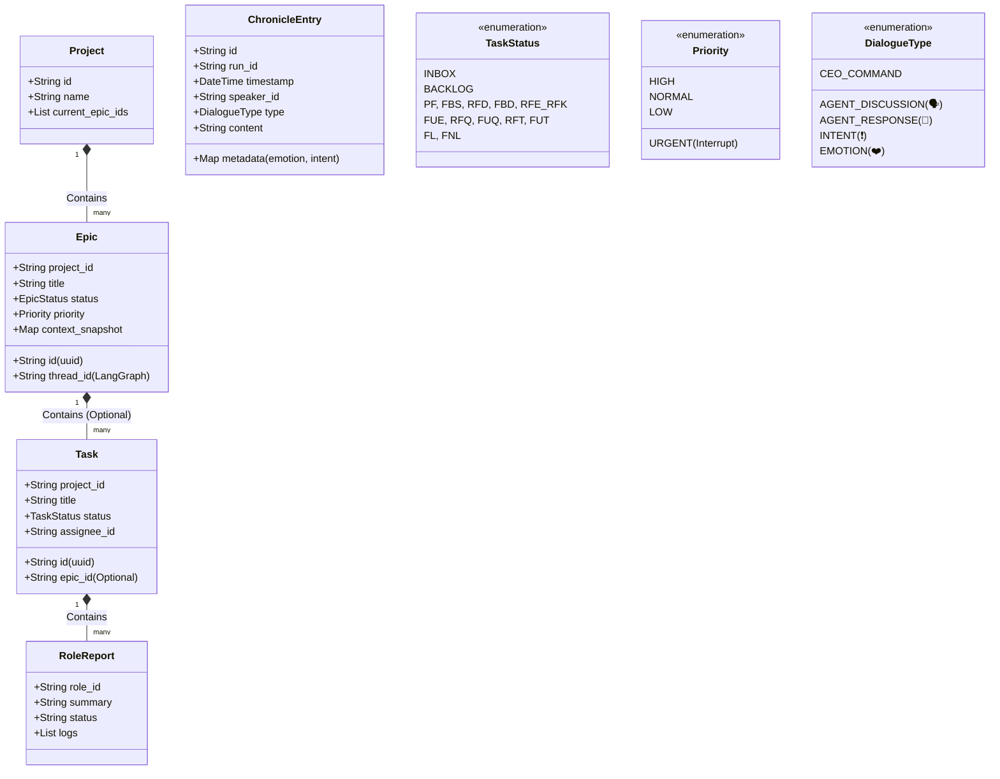
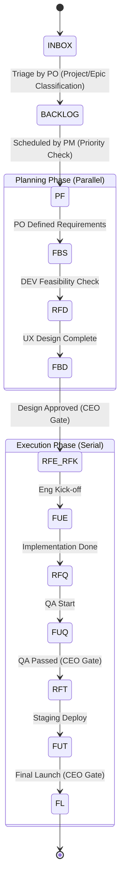

# 🏛️ 가재 컴퍼니 시스템 설계 (Sanctuary Architecture v13.6 - The Complete Archive)

**[문서의 목적]**: 본 문서는 **OpenClaw (AI Agent)**에게 시스템 구축을 지시하기 위한 **최종 기술 명세서(Technical Specification)**입니다.
**[핵심 철학]**: "인간 CEO"와 "11명의 AI 가재 군단"이 **PC 환경**에서 공존하며, **비서가재(Biseo Gajae)**가 지능적 게이트키퍼로서 중재하고, 그 모든 과정은 **크로니클(Chronicle)**로 투명하게 기록됩니다.

---

## 1. 런타임 아키텍처 (Runtime Architecture)

**[물리적 환경]**: Mac (PC) + Telegram Bridge + Firestore Database.
**[코드베이스]**: `gajae-os` (TypeScript + LangGraph.js)



### 1.1 성역의 수호자들 (Sanctuary Squad - Domain Experts)
**[Concept]**: 12명의 가재는 각자 **고유한 전문 도메인(Role)**과 **페르소나(Persona)**를 가집니다. **모든 도구(Tool) 사용 권한**을 가지며, 역할에 맞게 자율적으로 판단하여 사용합니다.

| 코드 ID | 한글 애칭 | 역할 (Role) | 비고 |
| :--- | :--- | :--- | :--- |
| `biseo` | **비서가재** | 문지기 (Gatekeeper) | CEO 직속, 명령 수신, `INBOX` 관리, `Focus` 추적 |
| `pm` | **매니저가재** | 공정 관리 (Manager) | 13공정 통제, 우선순위 조정, 일정 관리 |
| `po` | **기획가재** | 기획 (Product Owner) | 백로그 분류, 요구사항 정의, 스펙 결정 |
| `ba` | **분석가재** | 분석 (Business Analyst) | 비즈니스 로직, 데이터 분석 |
| `ux` | **디자인가재** | 디자인 (UX/UI Designer) | 사용자 경험, UI 설계 |
| `dev` | **개발가재** | 개발 (Developer) | 코드 구현, 아키텍처 |
| `qa` | **품질가재** | 품질 (Quality Assurance) | 테스트, 버그 검증 |
| `hr` | **인사가재** | 인사 (HR Manager) | 리소스/일정 조율 |
| `mkt` | **마케팅가재** | 마케팅 (Marketer) | 대외 홍보, 카피라이팅 |
| `legal` | **변호사가재** | 법무 (Legal Advisor) | 라이선스/법적 검토 |
| `cs` | **민원가재** | 고객지원 (CS Specialist) | 사용자 피드백 대응 |

---

## 2. 데이터 모델 (Data Model Hierarchy)

### 2.1 UML Class Diagram (Logic View)



### 2.2 Firestore Schema Definition

#### A. `/projects/{projectId}`
*   `name`: 프로젝트명
*   `current_epics`: 진행 중인 Epic ID 목록

#### B. `/epics/{epicId}`
*   `project_id`: 소속 프로젝트 ID
*   `title`: 에픽 명칭
*   `status`: 상태 (PLANNING, IN_PROGRESS, DONE, PAUSED)
*   `priority`: 우선순위 (**URGENT**, HIGH, NORMAL, LOW)
*   `thread_id`: LangGraph 상태 저장용 ID
*   `artifacts`: 산출물 링크 목록 (Git 경로 + 웹 URL)
*   `context_snapshot`: 장기 보존용 상태 스냅샷 (Resync 용)

#### C. `/tasks/{taskId}` (Work Queue Item)
*   `epic_id`: 소속 에픽 ID (**Optional** - 없으면 백로그)
*   `project_id`: 소속 프로젝트 ID
*   `title`: 작업명
*   `instruction`: 구체적 작업 지시
*   `status`: **INBOX**, **BACKLOG**, **PF**, ... (13공정)
*   `assignee`: 담당 가재 ID (`dev`, `po`...)

#### D. `/tasks/{taskId}/reports/{roleId}` (Role-Specific Memory)
*   `role_id`: `dev`, `ux` 등
*   `summary`: 해당 역할 관점의 요약 (기술적/디자인적 등)
*   `status`: DONE, IN_PROGRESS
*   `logs`: 해당 역할의 실행 로그 모음

#### E. `/chronicles/{runId}/entries/{entryId}` (Logs)
*   `speaker_id`: 발화자 (biseo, pm, dev...)
*   `type`: `AGENT_DISCUSSION`(🗣️), `AGENT_RESPONSE`(💬), `INTENT`(❗️), `EMOTION`(❤️)
*   `content`: 마크다운 내용
*   `metadata`: 상세 정보 (숨김 처리 가능)

---

## 3. 핵심 메커니즘 (Core Mechanisms)

### 3.1 비서가재 & 매니저가재 프로토콜 (The Executive Loop)
1.  **발화:** CEO "이거 하자" -> 비서가재가 `INBOX` 상태로 Task 생성.
2.  **분류 (Triage):** 기획가재(PO)가 `INBOX`를 주기적으로 검토하여 `Project/Epic` 분류.
3.  **계획 (Scheduling):** 매니저가재(PM)가 분류된 Task의 우선순위를 보고 `BACKLOG` -> `PF(착수)`로 상태 변경.
4.  **긴급 대응:** CEO가 "긴급!" 선언 시, 비서가재가 즉시 `URGENT Epic` 생성 후 매니저가재 호출 -> 강제 인터럽트 발동.

### 3.2 Direct Spawn & Context Injection
*   **No Watcher:** 별도의 Watcher 프로세스 없이, 매니저가재가 필요할 때 `sessions_spawn` 툴을 호출하여 에이전트를 직접 깨움.
*   **Context Injection:** 깨울 때 해당 에이전트의 `RoleReport` (과거 요약)와 `Current Task Info`를 주입하여 실행.
*   **Focus Tracking:** 비서가재는 항상 `Current Focus` (현재 어떤 Epic/Task를 보고 있는지)를 유지하여 대화의 문맥을 연결함.

### 3.3 13단계 공정 & 승인 게이트 (Approval Gate)



**[Kinetic 13 Protocol Details]**
*   **PF (Planning First):** 기획가재(PO)가 요구사항 정의.
*   **FBS (Feasibility Study):** 개발가재(DEV)가 기술 검토.
*   **RFD (Request for Design):** 디자인가재(UX) 호출.
*   **FBD (Finalize by Design):** 디자인 완료 및 CEO 승인.
*   **RFE_RFK (Request for Eng Kickoff):** 개발 착수 승인 (Gate).
*   **FUE (Feature Under Eng):** 개발가재(DEV) 구현.
*   **RFQ (Request for QA):** 구현 완료, 품질가재(QA) 호출.
*   **FUQ (Feature Under QA):** 테스트 진행.
*   **RFT (Request for Test):** QA 통과 보고 및 CEO 승인 (Gate).
*   **FUT (Feature Under Test):** 스테이징 배포 및 최종 확인.
*   **FL (Feature Launch):** 라이브 배포.

*   **CEO Super Pass:** CEO 명령 시 특정 단계 건너뛰기(Skip) 및 강제 전이 가능.

### 3.4 뇌 부활 및 재동기화 (Resync Protocol)
*   **Sleep (동면):** Epic 종료/중단 시 `Summary` 작성 후 컨텍스트 삭제.
*   **Wake Up (1년 뒤):**
    1.  DB에서 `context_snapshot` 로드.
    2.  현재 파일 시스템과 비교(Diff).
    3.  변경된 환경에 맞춰 상태(State) 보정 후 재개.

### 3.5 아티팩트 관리 (Dual Storage)
*   **원본:** Git 저장소 (`docs/epics/...`)에 마크다운으로 저장.
*   **인덱스:** Firestore에 해당 파일의 링크 저장.
*   **보고:** 비서가재가 DB 조회 후 "여기 있습니다" 하고 링크 제공.

---

## 4. 구현 가이드 (Implementation Guide)

### 4.1 디렉토리 구조 (Canonical Directory)
```
docs/
├── epics/                  # 에픽별 산출물 아카이브
│   ├── E001-login/
│   │   ├── 1-plan/ (1pager.md)
│   │   ├── 2-design/ (gui.md)
│   │   └── 3-dev/ (api.md)
├── core/role/              # 가재별 역할 정의 (ROLE_DEV.md)
└── gajae-os/               # 시스템 코드 (TS)
```

### 4.2 기술 스택
*   **Language:** TypeScript (Node.js)
*   **Orchestration:** LangGraph.js
*   **Storage:** Firestore (Data/Queue) + Local Git (Docs/Code)

---

**[결론]**: 이 설계도는 **비서가재(Brain)**와 **가재 OS(Body)**가 결합된 완전 자율형 조직 시스템입니다. 🦞🚀